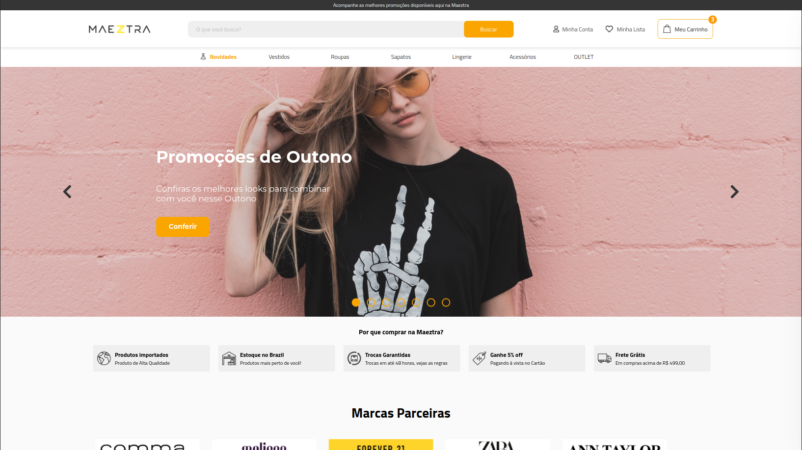
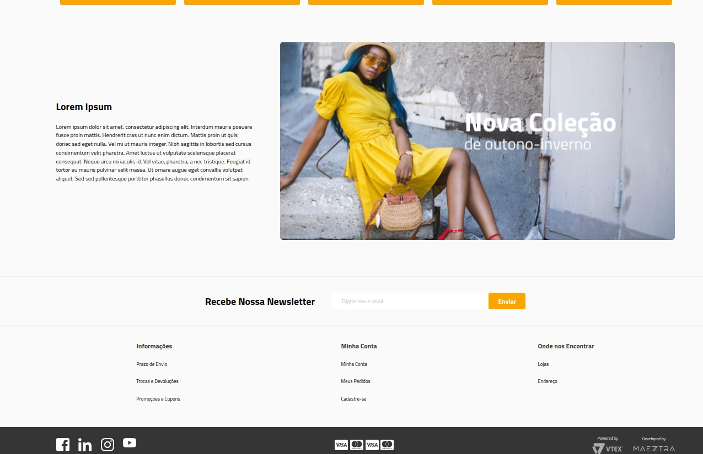
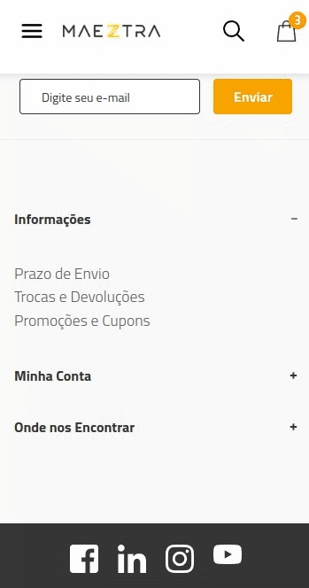

<a href="https://aimeos.org/">
    
</a>

# DESAFIO MAEZTRA LAYOUT

<!--  -->

- [DESAFIO MAEZTRA LAYOUT](#desafio-maeztra-layout)
- [LINKS](#links)
- [STACK](#stack)
- [DEPLOY](#deploy)
- [LAYOUT](#layout)
  - [NEWSLETTER](#newsletter)
  - [HEADER](#header)
  - [HERO](#hero)
  - [DEALS | PARTNERS](#deals--partners)
  - [SHELF](#shelf)
  - [INFOCARD | FOOTER](#infocard--footer)

# LINKS

- [https://eltonleao.github.io/desafio-meztra-layout/](https://eltonleao.github.io/desafio-meztra-layout/)
- [https://maeztra.eltonleao.com](https://maeztra.eltonleao.com)
- [Layout Figma](https://www.figma.com/file/3RqPfS5PW9whbQNCTTaoqA/%5B2020-09%5D-MZ---Layout-Teste-de-vagas-para-time-de-Devs)

# STACK

Este projeto está sendo desenvolvido usando React, Next.js, Typescript e Material Tailwind.

Para rodar bastar clonar o projeto e dar install e dev.

```bash
npm install
npm run dev
```

# DEPLOY

# LAYOUT

## NEWSLETTER

Ao cadastrar-se na newsletter você receberá um email de teste.

A funcionalidade foi feita enviando uma requisição http para meu serviço hospedado em https://api.eltonleao.com/maeztra


## HEADER

Ao fazer uma busca simulo uma requisição usando a [https://fakestoreapi.com/](https://fakestoreapi.com/), e mostro os resultados em um modal sempre com um "de para" com 20% de desconto do valor que retorna da api.


<!--  -->

O carrinho está com produtos estáticos mas é possível visualizar o drawer com os produtos mockados.


## HERO

O carousel de produtos foi desenvolvido usando o [react-slick](https://react-slick.neostack.com/).


## DEALS | PARTNERS

A funcionalidade de carousel das seções de deals e partners também foram desenvolvidas usando o [react-slick](https://react-slick.neostack.com/)


## SHELF

O carousel de produtos foi desenvolvido usando o [react-slick](https://react-slick.neostack.com/).

Usei Stable Diffusion através da plataforma [playground.ai](https://playgroundai.com/) para gerar as images de variações usando a imagem base no figma.

Ao passar sobre o sku a imagem é trocada.

Ao clicar em adicionar, simulo um toast de sucesso ao adicionar no carriho.


## INFOCARD | FOOTER

Assim como todas as seções, info card e footer foram desenvolvidas de forma responsiva usando tailwind + css customizado.


