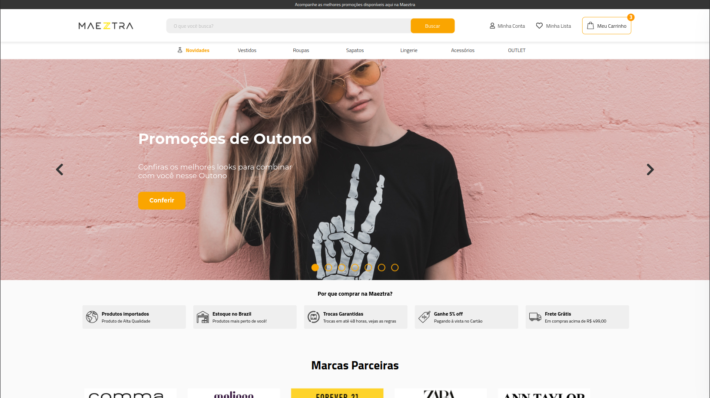

<a href="https://aimeos.org/">
    
</a>

# DESAFIO MAEZTRA LAYOUT

[https://maeztra.eltonleao.com](https://maeztra.eltonleao.com)



- [DESAFIO MAEZTRA LAYOUT](#desafio-maeztra-layout)
  - [STACK](#stack)
  - [HEADER](#header)
  - [HERO](#hero)
  - [DEALS](#deals)
  - [PARTNERS](#partners)
  - [SHELF](#shelf)
  - [INFOCARD](#infocard)
  - [NEWSLETTER](#newsletter)
  - [FOOTER](#footer)
  - [LINKS](#links)

## STACK

Este projeto está sendo desenvolvido usando React, Next.js, Typescript e Material Tailwind.

Para rodar bastar clonar o projeto e rodar os seguintes comandos:

```bash
npm install
npm run dev
```

## HEADER

Ao fazer uma busca simulo uma requisição usando a [https://fakestoreapi.com/](https://fakestoreapi.com/), e mostro os resultados em um modal sempre com um "de para" com 20% de desconto do valor que retorna da api.


O carrinho está com produto estáticos mas é possível visualizar o drawer com os produtos fake adicionados.


## HERO

O carousel de produtos foi desenvolvido usando o [react-slick](https://react-slick.neostack.com/).


## DEALS

## PARTNERS

## SHELF

O carousel de produtos foi desenvolvido usando o [react-slick](https://react-slick.neostack.com/).

Usei stable difision para gerar as images de variações usando a imagem base no figma.

Ao passar sobre o sku a imagem é trocada.

Ao clicar em adicionar, simulo um toast de sucesso.


## INFOCARD

## NEWSLETTER

## FOOTER

## LINKS

- [https://maeztra.eltonleao.com](https://maeztra.eltonleao.com)
- [Layout Figma](https://www.figma.com/file/3RqPfS5PW9whbQNCTTaoqA/%5B2020-09%5D-MZ---Layout-Teste-de-vagas-para-time-de-Devs)
